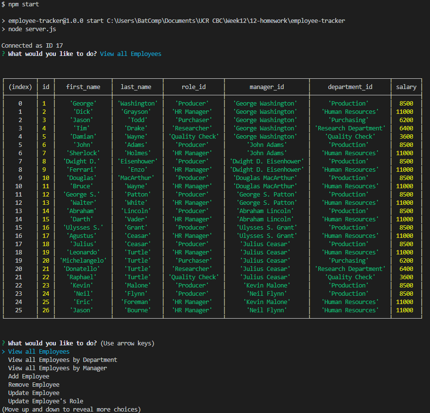
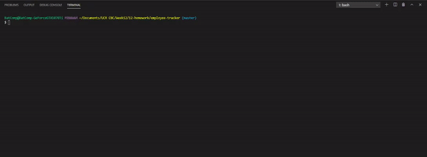

# Employee Engine CMS Interface

## Table of Contents
1. [ Description ](#desc)
2. [ Installation ](#install)
3. [ Usage ](#usage)
4. [ License ](#lic)
5. [ Contributing ](#contrib)
6. [ Tests ](#test)
7. [ Questions ](#quest)
    

## 1. Description
Developers are often tasked with creating interfaces that make it easy for non-developers to view and interact with information stored in databases. Often these interfaces are known as Content Management Systems. In this homework assignment, your challenge is to architect and build a solution for managing a company's employees using node, inquirer, and MySQL.
    

## 2. Installation
By downloading the package.json file within, it should enable the download of all necessary files, by using npm install inside the Terminal corresponding the Script.JS file.  After initial installation, entering the command node, or nodemon script.js within the Terminal would run CMS Employee Application
    

## 3. Usage
CMS Application inquirers to fill out Employee status questions.  Stores, and keep organize for easy use.
    

## 4. License
MIT
    

## 5. Contributing
none
    

## 6. Tests

    

## 7. Questions
Please visit my GitHub to view all of my work:

https://www.github.com/CdmMandalorian 

Contact me at: egalindounited@gmail.com

## Screenshots of Empoloyee Tracker:

## LIVE VIDEO GIF's OF Employee Tracker:

## Repository:  
[Employee Engine Tracker](https://github.com/CdmMandalorian/employee-tracker)  

  
## Portfolio:  
[Armando Galindo Portfolio](https://cdmmandalorian.github.io/Armando-E-Galindo-Portfolio/)
  
## Credits:    
               
Javascript          
MySql        
Node       